# PlantUML Diagramming

Match project conventions. Check existing `.puml` files first — naming, layout, theme, abstraction. Check for shared `!include` or theme file. Defaults below apply only if no project convention exists.

## Never rules

Unconditional. Break = broken or unreadable diagram.

- **Never omit `@startuml`/`@enduml`** — PlantUML fails silent without them. Every file needs delimiters (or type equivalent: `@startmindmap`/`@endmindmap`, `@startgantt`/`@endgantt`).

- **Never use cryptic abbreviations as labels** — plain English. `AuthSvc` means nothing to PM; `Authentication Service` does. Labels for humans, not compilers.

- **Never make >15 elements without grouping** — overcrowded = useless. Group with `package`, `rectangle`, `node`, `cloud`, `together`. Cannot group? Split file.

- **Never use legacy `skinparam` when `<style>` works** — `skinparam` deprecated. Use `<style>` blocks. Exception: properties `<style>` does not yet support (e.g. activity stereotypes still need `skinparam activity {}`).

- **Never hardcode inline colors on elements** — use stereotypes + `skinparam`/`<style>`. Inline `#FF0000` after `;` causes activity diagram syntax errors and drift.

- **Never mix arrow direction (`-up->`, `-down->`) with layout hacks** — let auto-layout work first. Direction hints only when auto-layout broken. Multiple overrides fight each other.

- **Never use `autonumber` without format** — bare `autonumber` = noise. Format string: `autonumber "<b>[000]"` or `autonumber 1 10 "<b>[00]"`.

- **Never omit participant declarations in sequence diagrams** — undeclared = source-order render = unstable layout. Declare all participants top, in display order.

- **Never write diagrams without `title`** — diagram without title = screenshot without caption.

## Audience and abstraction

**Default high-level, business-friendly.** Audience is non-technical team and new joiners. Plain labels, simple relationships, no jargon.

- Full words: "Payment Service" not "PaySvc"
- System boundaries + data flow, not internals
- Arrow labels = business actions: "submits order", "sends notification"
- Skip method signatures, DB columns, class internals unless asked

**Detailed/technical only when asked** (class diagrams with methods, DB schemas, detailed state machines). When unsure, ask.

## Diagram type selection

| Scenario | Type | Why |
|----------|------|-----|
| System interaction over time | Sequence | Temporal order + message flow |
| High-level architecture / boundaries | Component | Parts + relationships, no time |
| Infra and deployment | Deployment | Physical/cloud nodes |
| Business process with decisions | Activity | Branches, parallel paths, swimlanes |
| Object relationships (technical) | Class | Inheritance, composition |
| Lifecycle of single entity | State | Transitions for one stateful object |
| Feature scope / user goals | Use Case | Actors + capabilities at glance |
| Brainstorm / knowledge | Mindmap | Non-linear, fast |
| Project timeline | Gantt | Schedule, milestones, critical path |
| Work breakdown | WBS | Hierarchical decomposition |
| Data relationships (technical) | ER | Entities, attributes, cardinality |

## Sequence diagrams

Most common type. Show component interaction over time.

### Participants

Declare top, in display order. Right stereotype per role:

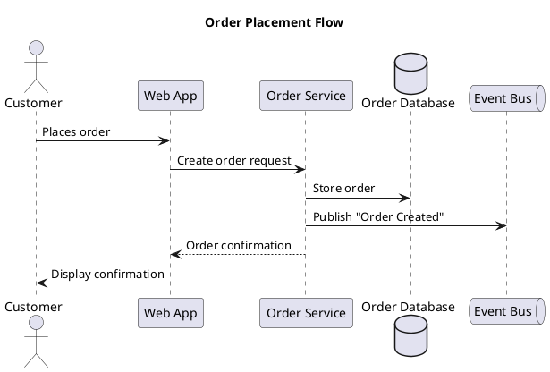

**Types:** `actor` (human), `participant` (service), `boundary` (API gateway), `control` (orchestrator), `entity` (domain object), `database` (store), `queue` (broker), `collections` (grouped).

### Arrows

| Syntax | Meaning |
|--------|---------|
| `->` | Sync request (solid, filled) |
| `-->` | Sync response (dashed, filled) |
| `->>` | Async message (solid, open) |
| `-->>` | Async response (dashed, open) |
| `->x` | Lost message |
| `<->` | Bidirectional |

### Activation

`activate`/`deactivate` or shorthand `++`/`--`:

```plantuml
Web -> Orders ++: Create order
Orders -> DB ++: INSERT order
DB --> Orders --: OK
Orders --> Web --: Order ID
```

### Grouping

```plantuml
alt Payment succeeds
    Orders -> Payments: Charge card
    Payments --> Orders: Success
else Payment fails
    Payments --> Orders: Declined
    Orders --> Web: Payment failed
end

opt Customer has loyalty account
    Orders -> Loyalty: Award points
end

loop For each item in cart
    Orders -> Inventory: Reserve stock
end

par Parallel notifications
    Orders ->> Email: Send confirmation
    Orders ->> SMS: Send text
end
```

### Notes, dividers, delays

```plantuml
note right of Orders: Validates inventory\nbefore charging
note over Web, Orders: All communication over HTTPS

== Fulfillment Phase ==

...Warehouse picks and packs order...

Shipping -> Customer: Delivery notification
```

## Component and deployment diagrams

High-level architecture. Boundaries + data flow, not internals.

### Component

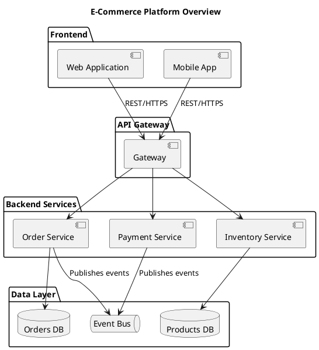

### Deployment

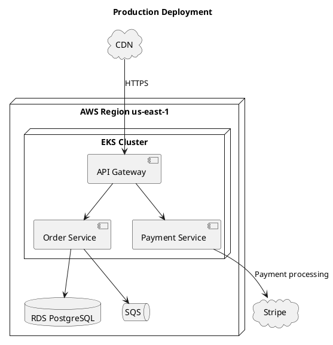

**Containers:** `node` (server/VM), `cloud` (external), `database` (store), `package` (logical group), `rectangle` (generic), `frame` (subsystem).

`interface` or `()` for ports:

```plantuml
() "REST API" as api
[Order Service] - api
```

## Activity diagrams

Business processes, workflows, decision flows. Swimlanes show responsibility.

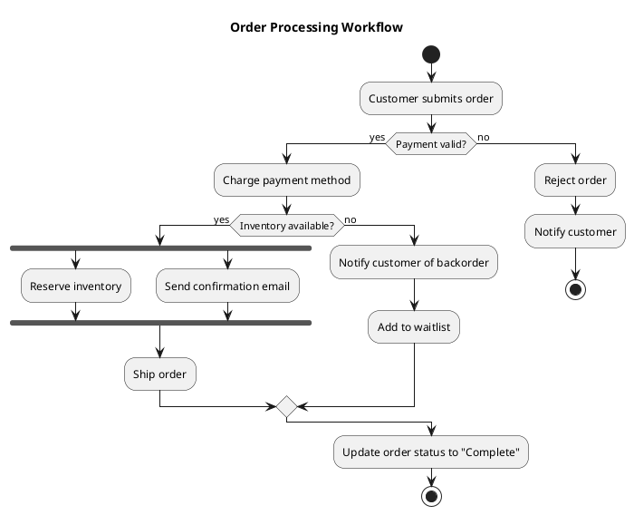

### Swimlanes

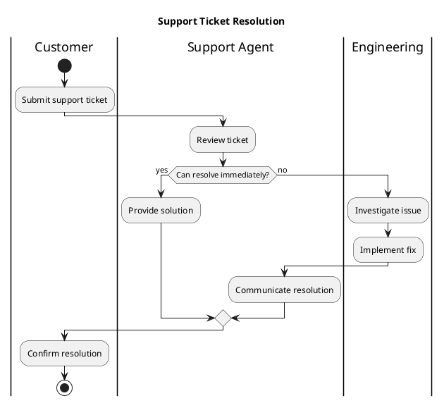

**Syntax:** `start`/`stop`, `:action;`, `if (cond?) then (yes) else (no) endif`, `fork`/`fork again`/`end fork`, `|Swimlane|`, `floating note right: text`.

### Coloring with stereotypes

Highlight paths (desired/error/regen) via **stereotypes + skinparam**. Inline `#color` after `;` breaks activity diagrams.

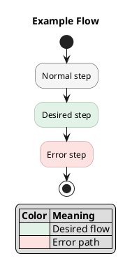

**Rules:**
- Stereotype colors in `skinparam activity {}` block top
- Apply via `<<stereotype>>` after `;`
- Color legend table for meaning
- Common: `<<desired>>`, `<<error>>`, `<<regen>>`, `<<newgen>>`, `<<fallback>>`
- `elseif` always needs `then` — omitting breaks downstream

## Class diagrams

**Technical only.** Use when explicitly asked for technical/detailed showing object relationships, inheritance, data modeling.

### Relationships

| Syntax | Meaning | Use When |
|--------|---------|----------|
| `<\|--` | Inheritance | "is a" |
| `*--` | Composition | Part dies with whole |
| `o--` | Aggregation | Part lives independently |
| `-->` | Dependency | Uses temporarily |
| `--` | Association | General |
| `..\|>` | Implements | Realizes interface |

### Example

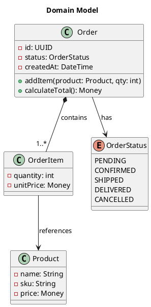

**Visibility:** `-` private, `+` public, `#` protected, `~` package.

**Stereotypes:** `<<interface>>`, `<<abstract>>`, `<<enum>>`, `<<service>>`, `<<entity>>`.

**Packages** group classes:

```plantuml
package "Orders Domain" {
    class Order
    class OrderItem
}
```

## State diagrams

Lifecycle of single entity — orders, tickets, accounts, deployments.

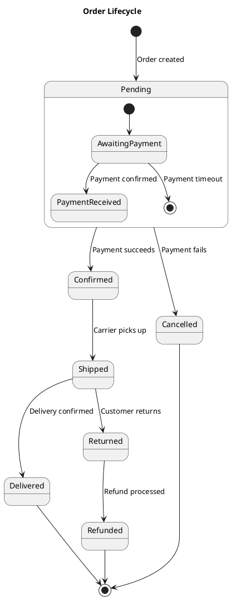

### Syntax

- `[*]` = initial/final pseudo-state
- `state Name { }` = composite/nested
- `state "Long Name" as alias` = alias
- `state fork_point <<fork>>` / `<<join>>` = concurrent fork/join
- `state choice_point <<choice>>` = decision

### Concurrent regions

```plantuml
state Processing {
    state "Verify Payment" as vp
    state "Check Inventory" as ci
    [*] --> vp
    [*] --> ci
    vp --> [*]
    ci --> [*]
    --
    state "Send Notification" as sn
    [*] --> sn
    sn --> [*]
}
```

## Other types

### Use case

Feature scope + actor interactions:

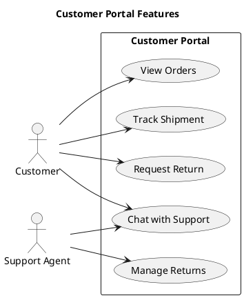

### Mindmap

Brainstorm / knowledge tree:

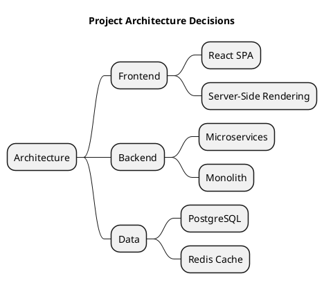

### Gantt

Timeline + dependencies:

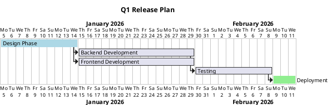

### WBS

Deliverable hierarchy:

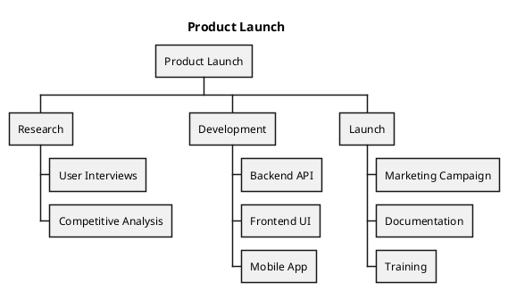

### ER (class syntax)

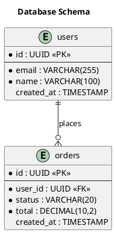

### JSON / YAML

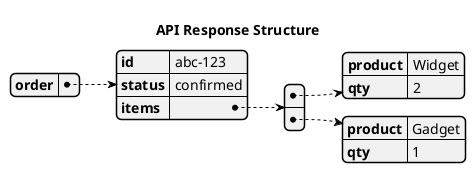

## Styling

### `<style>` blocks (preferred)

CSS-like, replaces legacy `skinparam`. Place after `@startuml`:

```plantuml
@startuml
title Styled Sequence Diagram

<style>
    sequenceDiagram {
        actor {
            BackgroundColor #E8F5E9
            BorderColor #2E7D32
        }
        participant {
            BackgroundColor #E3F2FD
            BorderColor #1565C0
        }
        arrow {
            LineColor #333333
        }
        note {
            BackgroundColor #FFF9C4
            BorderColor #F9A825
        }
    }
</style>

actor Customer
participant "Order Service" as OS
...
@enduml
```

### Built-in themes

`!theme` applies one:

```plantuml
@startuml
!theme cerulean
title Themed Diagram
...
@enduml
```

Common: `cerulean`, `plain`, `sketchy-outline`, `aws-orange`, `mars`, `minty`. Preview before commit.

### Color formats

- Named: `Red`, `LightBlue`, `DarkGreen`
- Hex: `#FF5733`, `#2196F3`
- Gradient: `#White/#LightBlue` (top to bottom)

### Layout direction

Default top-to-bottom. Wide diagrams:

```plantuml
left to right direction
```

After `@startuml`, before any element.

## Preprocessing

### !procedure

Reusable fragments:

```plantuml
!procedure $service($name, $alias)
    participant "$name" as $alias
!endprocedure

$service("Order Service", OS)
$service("Payment Service", PS)
```

### !function

Reusable computed values:

```plantuml
!function $endpoint($service, $path)
    !return $service + " " + $path
!endfunction
```

### Variables

```plantuml
!$primary_color = "#1565C0"
!$secondary_color = "#2E7D32"
```

### Conditionals + loops

```plantuml
!if (%getenv("DETAIL_LEVEL") == "high")
    class Order {
        - id: UUID
        - status: OrderStatus
        + addItem(product: Product, qty: int)
    }
!else
    rectangle "Order Service"
!endif

!$i = 0
!while ($i < 3)
    node "Worker $i"
    !$i = $i + 1
!endwhile
```

## Anti-patterns

- **Overcrowded without grouping** — >15 ungrouped = unreadable. Split or group.
- **Tech jargon in business diagrams** — `POST /api/v2/orders` belongs in API docs. Use "Creates order".
- **Mixing styling approaches** — inline + `skinparam` + `<style>` in one file = conflicts. Pick one. Prefer `<style>`.
- **Deep nesting >3 levels in component diagrams** — tiny illegible boxes. Flatten or split.
- **Missing titles + legends** — useless in multi-diagram docs. `title` always, `legend` when relationships need explaining.
- **Class diagrams when simpler works** — `Order -> PaymentService` as class relationship when component or sequence says it clearer. Pick simplest type.
- **Copy-paste instead of `!include`** — duplicated participants drift. Extract shared defs.
- **Direction keywords everywhere** — sprinkling `-up->`, `-left->`, `-right->` fights layout engine, makes worse. Sparingly only.
- **Bare `autonumber`** — plain integers add noise. Format or omit.
- **Undeclared participants** — source-order render = unstable when adding messages.
